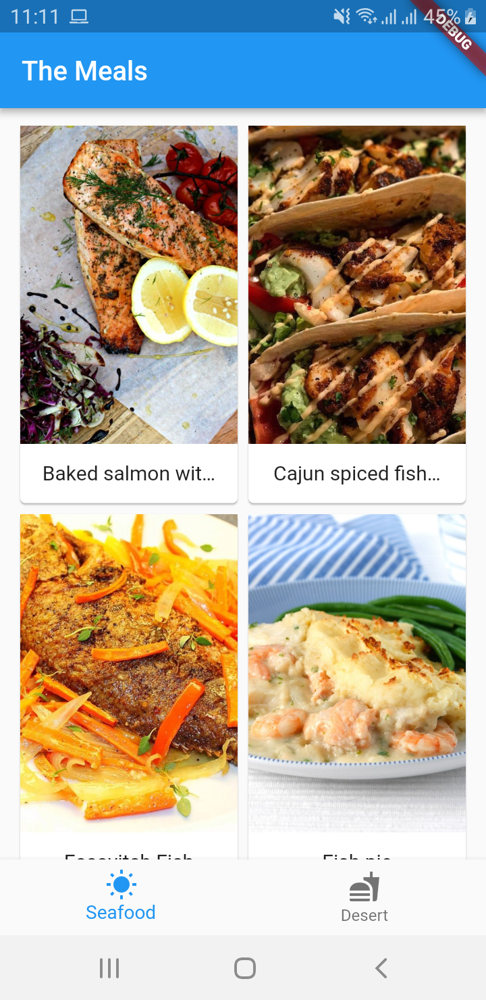
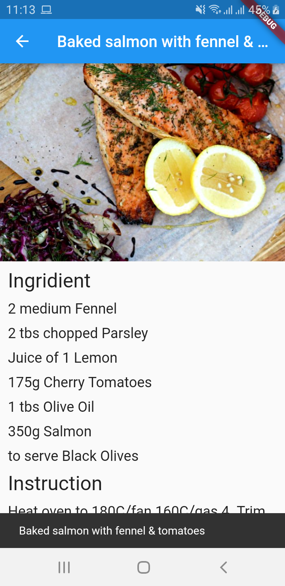
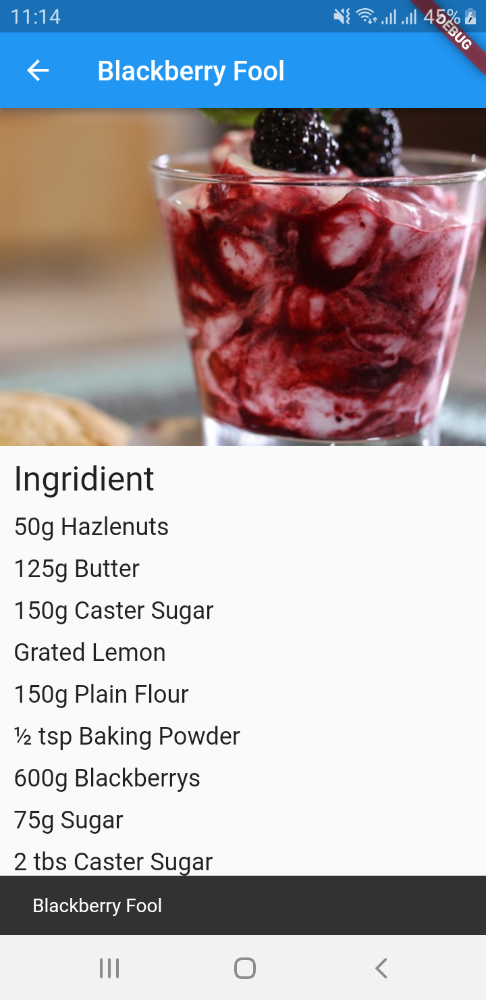

# The Meal

Aplikasi ini membahas tentang mengambil data makanan dari <a href="https://www.themealdb.com/">The Meal Db</a> untuk di tampilkan di aplikasi Flutter.

### Feature
- <a href="https://flutter.dev/docs/cookbook/networking/fetch-data">Http</a>
- <a href="https://pub.dartlang.org/packages/rxdart">RxDart</a>
- <a href="https://www.themealdb.com/">API</a>
- <a href="https://felangel.github.io/bloc/#/gettingstarted">BLoC</a>

### TODO
- SQFlite

### Screenshots Aplikasi

<pre>
                           
</pre>

## Author

* **R Rifa Fauzi Komara**

Jangan lupa untuk follow dan ★
