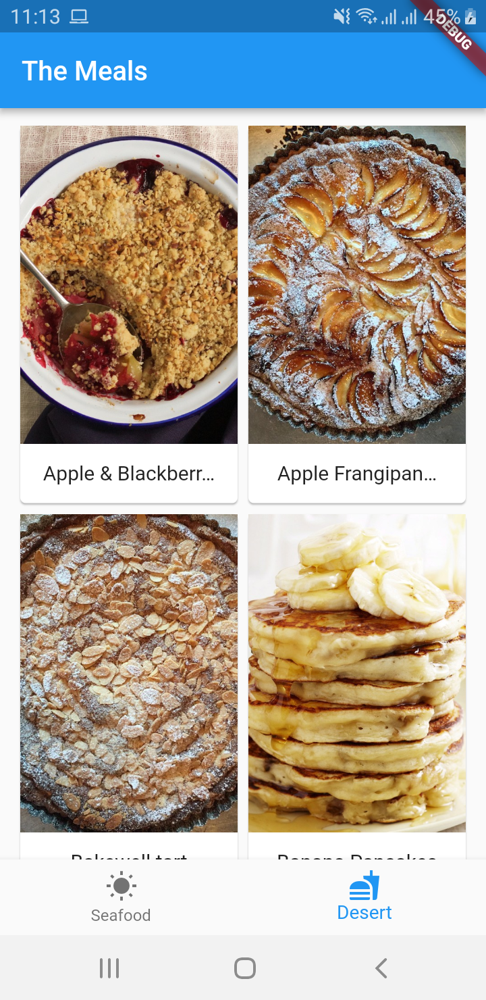

# The Meal

A new Flutter application.

## Getting Started

This project is a starting point for a Flutter application.

A few resources to get you started if this is your first Flutter project:

- [Lab: Write your first Flutter app](https://flutter.io/docs/get-started/codelab)
- [Cookbook: Useful Flutter samples](https://flutter.io/docs/cookbook)

For help getting started with Flutter, view our 
[online documentation](https://flutter.io/docs), which offers tutorials, 
samples, guidance on mobile development, and a full API reference.

Aplikasi ini membahas tentang mengambil data movies dari <a href="www.themoviedb.org">The Movie Db</a> untuk di tampilkan di aplikasi android.

### Feature
- Http
- RxDart
- Json
- API
- BLoC

### TODO
- SQFlite

### Screenshots Aplikasi

<pre>
                           
</pre>

## Author

* **R Rifa Fauzi Komara**

Jangan lupa untuk follow dan ★
